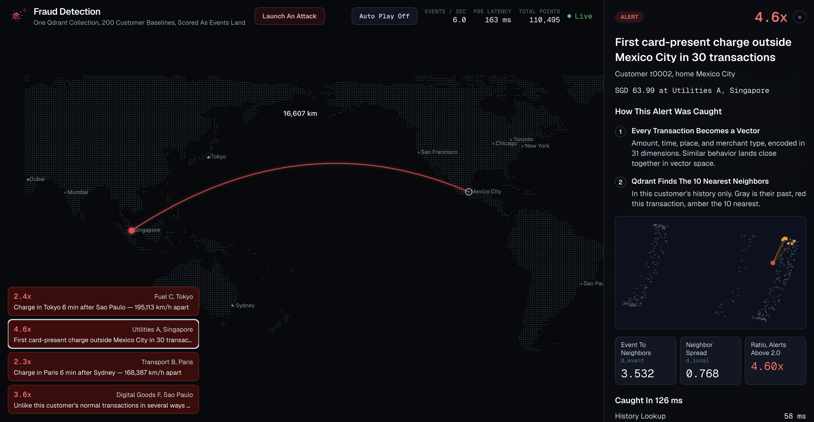

<p align="center">
  <picture>
    <source media="(prefers-color-scheme: dark)" srcset="public/qdrant-fraud-detection-lockup-dark.png">
    
  </picture>
</p>

# Qdrant Fraud Detection: Per-Customer Anomaly Scoring in One Collection

**[Live demo →](https://demo-fraud-detection-eta.vercel.app)**

A live fraud-wall demo for a fictional card network. Synthetic transactions appear on a world map at their real coordinates. Fraud lights up within about a second, and every alert opens an evidence panel that shows how Qdrant caught it in vector space.



The demo keeps 200 customer baselines, or 109,446 points, in one [Qdrant](https://qdrant.tech) collection. Each new transaction becomes a 31-dimensional vector, searches only that customer's history, and alerts when its local distance ratio passes `2.0`.

Qdrant is the only backend:

- One collection for every customer baseline
- Tenant-keyed payload indexes for customer isolation
- k-nearest neighbor search for anomaly scoring
- Formula queries for recency-aware ranking
- Immediate upserts so bursts score against fresh events
- Timestamp-filtered scrolls instead of a queue

## The Wall

Open `/` and the traffic follows daylight around the globe. Alerts collect in a queue. Select an alert to zoom to the customer, draw a distance-labeled arc between cities, and see the score breakdown.

The evidence panel shows:

- The transaction's 31-dimensional feature vector
- The 10 nearest neighbors from that customer's own history
- The local distance ratio that triggered the alert
- A 2-D principal component analysis scatter of the customer's baseline
- The milliseconds spent in each Qdrant call

For booth demos, enable Auto Play for a self-running wall or share the URL to a phone. Launch An Attack opens three scenarios: Geo-Hop, Card Testing Burst, and Amount Ladder. Each attack lands on the map within a second or two. See The Evidence pins the story, including the 10 neighbors and the arithmetic that reproduces the stored score.

## How It Works

Every transaction is scored against the customer's own baseline:

1. Scroll the customer's 30 most recent points, ordered by the indexed `ts` field.
2. Search for the 10 nearest historical neighbors inside the same `tenant_id`.
3. Re-rank those neighbors with a recency-aware formula query.
4. Compute `d_event / d_local`, a self-normalizing k-nearest neighbor ratio.
5. Alert when the ratio exceeds `2.0`.
6. Upsert the scored event with `wait: true`, so the next event can search against it.

The feature vector comes from a pure function, not a learned model. That keeps the evidence panel explainable: the stored neighbor IDs, distances, and score can reproduce the exact decision later, even after newer points arrive.

The first 30 events for a new customer score but never alert, which gives each customer a learning window.

## Qdrant Query

The core detection step is one formula query over a tenant-filtered prefetch. The prefetch excludes the last hour, so a fraud burst cannot become its own nearest-neighbor cluster and hide itself.

```json
{
  "prefetch": {
    "query": "<event_vector>",
    "using": "features",
    "filter": {
      "must": [
        { "key": "tenant_id", "match": { "value": "<tenant_id>" } },
        { "key": "ts", "range": { "lt": "<event_ts_minus_1h>" } }
      ]
    },
    "limit": 100
  },
  "query": {
    "formula": {
      "sum": [
        { "mult": [-1.0, "$score"] },
        { "mult": [0.15, { "exp_decay": {
          "x": { "datetime_key": "ts" },
          "target": { "datetime": "<event_ts>" },
          "scale": 2592000,
          "midpoint": 0.5
        } } ] }
      ]
    }
  },
  "with_vector": true,
  "limit": 10
}
```

The Euclid prefetch score sorts closest first, while formula queries sort larger scores first. The distance term is negated before it mixes with `exp_decay`; see the [search relevance docs](https://qdrant.tech/documentation/search/search-relevance/).

## Qdrant Patterns

- **Multitenancy:** The `tenant_id` keyword index uses `is_tenant: true`, so Qdrant co-locates each customer's vectors and keeps per-customer k-nearest neighbor search fast as the collection grows.
- **Immediate Consistency:** Each scored event is upserted with `wait: true`, so the next event in a burst can search against it with no refresh cycle.
- **Message Bus:** A phone-launched attack may score on a different serverless instance than the wall stream. The wall picks it up with a timestamp-filtered scroll on an indexed `channel_src` field.
- **Bounded Growth:** Each stream connection deletes scored events older than 24 hours with a `must_not is_empty(score)` filter. Seeded baseline points carry no `score` field, so they survive. [`evals/janitor.ts`](evals/janitor.ts) checks this.

Feature layout and weights live in [`src/lib/features.ts`](src/lib/features.ts). The tuning record lives in [`evals/TUNING.md`](evals/TUNING.md).

## Measured Results

Every number comes from scripts in [`evals/`](evals). Run them with `npm run evals`.

| Eval | Result |
|---|---|
| Motif detection | Sequence recall 0.833, precision 0.754 at threshold 2.0 on the default seed; 0.950 and 0.833 on a held-out seed |
| Latency | Per-event scoring p95 475 ms measured one region away, with about 100 ms RTT and three round trips per event; launch-to-wall flare 0.9-2.1 s |
| Cold start | Pass: zero alerts inside a fresh customer's 30-event learning window |
| Tenant isolation | Pass: scoring against the wrong customer's baseline shifts the score by 56.5% |
| Determinism | Pass: two runs at the same world seed produce identical alert sets |
| API contract | 5/5 pass, asserting on computed values, not status codes |

Latency is dominated by round-trip time. Deploy the compute next to the Qdrant cluster if you want sub-second flare timing.

## Run It

Requires:

- Qdrant Cloud cluster, 1-2 GB
- Node 20 or newer

```bash
npm install
cp .env.example .env          # fill in QDRANT_URL and QDRANT_API_KEY
npx tsx --env-file=.env scripts/seed.ts   # ~100k baseline points across 200 customers
npm run dev                   # http://localhost:3000
npm run evals                 # runs the suite against throwaway collections
```

## Scope

This demo shows the retrieval mechanics behind per-customer anomaly scoring on synthetic data. It is not a production fraud model.

The synthetic world separates fraud from normal traffic more cleanly than real payments. The threshold and features are tuned on this generator and validated on a held-out seed. The one-hour neighbor exclusion is sized to this demo's motif durations.

---

Licensed under Apache-2.0. See [LICENSE](LICENSE).
