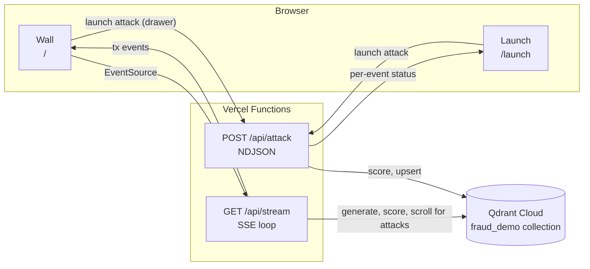

<p align="center">
  <picture>
    <source media="(prefers-color-scheme: dark)" srcset="public/qdrant-fraud-detection-lockup-dark.png">
    
  </picture>
</p>

A live payments wall for a fictional card network. Synthetic transactions ping on a dark world map at their real coordinates, fraud ignites red within a second or two of launch (sub-second on a deployment pinned next to the cluster), and every alert plays out as a story: the camera zooms to the customer, and one panel tells the rest in plain language: what happened, how the alert was caught in vector space, and how many milliseconds it took. "Normal" is defined per customer, and per-customer baselines are expensive to run elsewhere: per-namespace pricing, table partitioning, or a separate index per customer. This demo keeps 200 customer baselines in one [Qdrant](https://qdrant.tech) collection, isolates each customer with a tenant-keyed payload index, and scores every new event against that customer's own history the moment it lands. Qdrant is a vector search engine, and here it is the only backend: no queue, no cache, no relational store.

## What You See

The wall (`/`) is a dark, full-screen world map. Each transaction pings at its city the moment it scores, and traffic follows daylight around the globe because every customer transacts in their home city's waking hours. Drag to pan. When an event alerts, the camera zooms to fit the customer's home and the event locations in the visible map area, and an impossible-travel alert draws a glowing arc between the two cities labeled with the distance in km. Alerts from one customer within 20 seconds coalesce into a single story, so a six-charge burst reads as one attack. A ticker shows events per second, p95 score latency, and total points, live.

A pinned story opens one panel that reads top to bottom: the plain-language reason and the charge trail, then How This Alert Was Caught in three steps (every transaction becomes 31 numbers; Qdrant finds the 10 most similar past transactions in this customer's own history; the distance ratio past 2.0 decides), with the animated vector-space scatter between the steps: the baseline cloud fades in (2-D PCA computed in the browser), the event drops in red, the 10 pinned neighbors light up amber, and the arithmetic counts up. A closing section, Caught In N ms, breaks the speed into history lookup, similarity search, and saving the event. The map shows where the fraud happened; the panel shows why the search flagged it and how fast.

Alerts collect in a queue at the lower left, one entry per attack. By default nothing plays on its own: click an entry to pin its story, study it as long as you want, and close it with the × when done. The Auto Play toggle switches to a self-running loop that plays each new story for about seven seconds, which is the mode for a booth wall; the setting survives reloads.

Launch An Attack opens a drawer on the wall itself: you get a pre-seeded persona, tap one of three attack cards (Geo-Hop, Card Testing Burst, or Amount Ladder), watch the per-event scores stream in, and see the flare land on the map behind the drawer. The whole demo works from one page.

The evidence panel (`/alert/[id]`) opens when you click an alert. It shows the score arithmetic step by step, the ten nearest neighbors with their real distances, and the customer's baseline projected to 2-D with PCA computed in the browser. The score it displays is recomputed from the neighbor set pinned at scoring time, so it reproduces the original number exactly.

The standalone launch page (`/launch`) is the phone path for the booth hero moment: an audience member scans a QR code or opens a shared link, gets the same persona and attack cards, and watches the flare land on the projected wall. It renders the same launcher component as the wall's drawer, plus a compact embedded wall strip so the flow reads from a single phone screen.

### Demo Script

1. Open the wall: events pinging around the world map, ticker live.
2. Turn on Auto Play for a self-running wall, or click a story in the queue (one lands every 20 seconds or so): the camera zooms in, and the panel walks the audience from what happened, through the three steps of how it was caught, to the milliseconds it took.
3. Click View Full Evidence for the deep page: the neighbor list with real distances and the exact arithmetic, reproduced from the pinned neighbor set.
4. Hero: open the launch drawer on the wall, or share the launch link with a phone. Pick an attack card and the flare lands before the phone drops; the phone then opens the evidence panel for the fraud it launched.
5. Mention: every event was searchable the instant it landed, in one collection, across 200 customers with one baseline each.

## Architecture



Qdrant is the only state. The SSE loop generates events on the fly, seeded by `(world_seed, time_bucket)` with deterministic event IDs, so a reconnect regenerates byte-identical events for the same bucket and upserts stay idempotent. A browser launch may hit a different serverless instance than the wall's stream, so the wall picks up recent browser attacks with a timestamp-filtered scroll: Qdrant is the message bus.

Scored events would otherwise accumulate forever (each open wall adds 5 to 6 points per second), so each new stream connection fires a janitor that deletes scored events older than 24 hours. Seeded baseline points carry no `score` payload field, so the janitor's `is_empty` guard never touches them; the collection stays bounded at the 109,446 baselines plus at most one day of live traffic. The check for this lives in [`evals/janitor.ts`](evals/janitor.ts).

| Route | Method | Purpose |
|---|---|---|
| `/` | GET | The wall |
| `/launch` | GET | Attack launcher, assigns a pre-seeded persona |
| `/alert/[id]` | GET | Evidence panel for one scored event |
| `/api/stream` | GET | SSE loop: generates, scores, and relays browser attacks |
| `/api/attack` | POST | Runs one attack sequence, streams per-event status as NDJSON |
| `/api/baseline/[tenant]` | GET | A customer's baseline vectors for the scatter plot |
| `/api/persona` | GET | Assigns a pre-seeded persona for the wall's launch drawer |

## How Scoring Works

Each transaction becomes a 31-dimensional engineered vector from a pure function, with no learned model, which is what lets the evidence panel explain a score honestly. The dimension layout and per-block weights live in the header comment of [`src/lib/features.ts`](src/lib/features.ts). Scoring is three Qdrant round trips per event: a context scroll for the customer's recent history (feeds the recent-history features and the cold-start check), a k-nearest-neighbor formula query within the customer's [tenant](https://qdrant.tech/documentation/manage-data/multitenancy/), then an upsert of the scored event so it is immediately searchable. The kNN query reorders neighbors by recency with an `exp_decay` term and excludes the last hour, so a fraud burst cannot become its own nearest-neighbor cluster and mask itself.

The score is a self-normalizing kNN ratio in the style of a local outlier factor: `d_event / d_local`, where `d_event` is the mean distance from the event to its ten neighbors, and `d_local` is the mean distance from those neighbors to their own centroid. It alerts when the ratio exceeds 2.0. The first 30 transactions per customer are a learning window: they are scored but never alerted, so a fresh customer with no baseline does not scream red. The Euclidean prefetch score sorts closest first while formula queries sort larger scores first, so the distance term is negated before it mixes with `exp_decay`; see the [search relevance docs](https://qdrant.tech/documentation/search/search-relevance/) for the formula query mechanics.

```json
{
  "prefetch": {
    "query": "<event_vector>",
    "using": "features",
    "filter": {
      "must": [
        { "key": "tenant_id", "match": { "value": "<tenant_id>" } },
        { "key": "ts", "range": { "lt": "<event_ts_minus_1h>" } }
      ]
    },
    "limit": 100
  },
  "query": {
    "formula": {
      "sum": [
        { "mult": [-1.0, "$score"] },
        { "mult": [0.15, { "exp_decay": {
          "x": { "datetime_key": "ts" },
          "target": { "datetime": "<event_ts>" },
          "scale": 2592000,
          "midpoint": 0.5
        } } ] }
      ]
    }
  },
  "with_vector": true,
  "limit": 10
}
```

The response score is the recency-adjusted ranking score, so `d_event` and `d_local` are recomputed client-side from the returned neighbor vectors, and the evidence panel shows that exact arithmetic.

## Eval Results

Every number below is measured. Scripts live in [`evals/`](evals); run them with `npm run evals`.

| # | Eval | Result |
|---|---|---|
| 1 | API contract | 5/5 pass, including a canary proving a misspelled request field is silently accepted, which is why every test asserts on computed values instead of status codes |
| 2 | Motif detection | Sequence recall 0.833, precision 0.754 at threshold 2.0 on the default seed, 0.950 and 0.833 on a held-out seed (confusion table below) |
| 3 | Cold start | Pass: zero alerts inside a fresh customer's 30-event learning window, normal scoring after |
| 4 | Determinism | Pass: two runs at the same world seed produce identical alert sets |
| 5 | Latency | Per-event scoring p95 475 ms and launch-to-wall flare 0.9-2.1 s, both measured from a laptop one region away (~100 ms RTT per round trip, three round trips per event); end-to-end flare on a region-pinned deployment pending, same as eval 7 |
| 6 | Tenant isolation | Pass: scoring an event against the wrong customer's baseline shifts the score by 56.5% relative difference |
| 7 | Public browser smoke | Pending deployment |

Motif-detection confusion table (default seed, 5k events, 60 labeled fraud sequences, 20 per motif):

```
                 alerted   not alerted
  fraud-labeled      156           104
  motif=none          51          4650
Recall (sequences): 50/60 = 0.833   per-motif: card_testing 1.00 | geo_hop 1.00 | ladder 0.50
Precision:          156/207 = 0.754
```

The eval places each fraud burst inside the background stream, so fraud interleaves with the customer's own traffic. Threshold 2.0 catches every card-testing and geo-hop sequence and 10 of the 20 ladder sequences. A ladder step competes with fresh background events at the same merchant for the recent-history slots, so its escalation chain is shorter by the time it scores. The full threshold sweep, the held-out-seed run, and the tuning rounds behind these constants are in [`evals/TUNING.md`](evals/TUNING.md).

Latency is dominated by RTT because scoring is three round trips. Pin the Vercel function region to the Qdrant cluster's region, or cross-region RTT alone eats the sub-second flare budget.

### Deviations From The Original Spec

- Alert threshold is 2.0, tuned down from the spec's starting 2.5 via the motif-detection sweep.
- The kNN query excludes neighbors from the last hour, which the spec did not call for, to stop a burst from masking itself.
- Dimension 30 is redefined: a count of consecutive same-merchant escalations rather than a single step ratio, because one step ratio cannot separate laddering from a log-normal baseline.
- Feature weights on dimensions 25, 26, 27, 29, and 30 changed from the spec, each recorded in `evals/TUNING.md`.
- `lat` and `lon` are stored in the payload on top of the spec's list, so a later event's impossible-travel feature can read the prior points' coordinates.
- Tenant active hours follow the home city's local time (roughly 7:00 to 22:00 local, mapped to UTC by longitude), and the live generator emits background traffic only for tenants inside their window. The spec pinned all windows to 6-23 UTC, which made every event outside those hours score as an hour-of-day anomaly: measured live at 23:21 UTC, 27% of background events alerted. With daylight-following windows, every wall-clock hour has 60-175 active tenants and background traffic stays inside its own baseline. Injected fraud motifs stay unfiltered by hour; fraud at an odd hour is realistic and part of the signal.

## Setup

Requires a Qdrant Cloud cluster (a 1-2 GB cluster is plenty) and Node 20 or newer.

```bash
npm install
cp .env.example .env          # then fill in QDRANT_URL and QDRANT_API_KEY
npx tsx --env-file=.env scripts/seed.ts   # ~100k baseline points across 200 customers
npm run dev                   # http://localhost:3000
npm run evals                 # runs the suite against throwaway collections
```

### Deploy On Vercel

1. Set `QDRANT_URL` and `QDRANT_API_KEY` (and optional `QDRANT_COLLECTION`) as environment variables on the project.
2. Pin the function region to the region of your Qdrant cluster. Each scored event costs three Qdrant round trips, so cross-region RTT alone can break the sub-second flare budget.
3. Seed the collection once from a machine with the same env vars before the first demo.

Production URL: (deployment pending).

## A Note On What This Is

This demonstrates the retrieval mechanics of per-customer anomaly scoring on synthetic data. It is not a production fraud model, and the eval numbers describe this synthetic world, not real payments. The synthetic world's background customers never visit a new merchant, so the new-merchant signal separates fraud from normal traffic more cleanly here than in real payments. The consecutive-escalation feature on dimension 30 was designed against this world's ladder motif. The one-hour neighbor exclusion is sized to this demo's motif durations, which run to about twelve minutes, and it is not a general fraud rule. The alert threshold of 2.0 was chosen on this generator and validated on a held-out seed: sequence recall 0.833 and precision 0.754 on the default seed, and 0.950 and 0.833 on the held-out seed.

---

Licensed under Apache-2.0. See [LICENSE](LICENSE).
